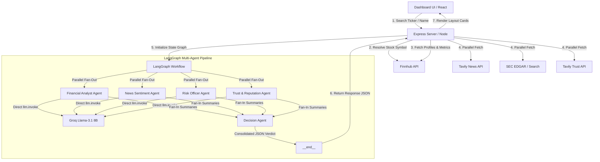

# Clari: Multi-Agent Investment Research Terminal

Clario is an AI-powered financial research terminal designed to run parallel, specialist multi-agent workflows. It ingests data from multiple financial and public feedback channels, resolves ticker symbols, and outputs a structured investment verdict alongside granular agent reports on a custom, responsive Neobrutalist dashboard.

---

##  System Architecture

Clario uses a **Frontend-Backend separation** combined with a **parallel multi-agent workflow** structured using LangGraph.



---

## Overview

**What it does:**

- Accepts a company name or ticker symbol (e.g., `Apple`, `AAPL`, `Reliance`, `OpenAI`)
- **Resolves the ticker** via Finnhub if a plain company name is given
- **Fetches four parallel data streams**: financial metrics, news articles, SEC 10-K filings, and public trust/reputation signals
- **Runs four specialist AI agents simultaneously** (Financial Analyst, News Sentiment, Risk Officer, Trust & Reputation) using a LangGraph parallel fan-out workflow
- A fifth **Decision Agent** synthesizes all four reports and returns a final investment verdict (`Invest`, `Hold`, or `Pass`), a numeric confidence score (0–100), critical highlights, and a brief reasoning summary
- The results are rendered as a **premium Neobrutalist dashboard** with color-coded agent cards, a sentiment gauge, SEC report link, and full decision panel

---

## How to Run

### Prerequisites

- [Node.js](https://nodejs.org/) v18 or later

### 1. Get Your API Keys

| Key | Where to get it | Free Tier |
|-----|-----------------|-----------|
| `GROQ_API_KEY` | [console.groq.com](https://console.groq.com) | ✅ Yes |
| `TAVILY_API_KEY` | [app.tavily.com](https://app.tavily.com) | ✅ Yes |
| `FINNHUB_API_KEY` | [finnhub.io](https://finnhub.io) | ✅ Yes |
| `SEC_USER_AGENT` | Your email (required by SEC for rate limits) | ✅ Yes |

### 2. Configure Environment

Create a `.env` file inside the `Backend/` directory:

```env
PORT=3000
GROQ_API_KEY=your_groq_api_key_here
TAVILY_API_KEY=your_tavily_api_key_here
FINNHUB_API_KEY=your_finnhub_api_key_here
SEC_USER_AGENT=your_email@example.com
```

### 3. Start the Backend Server

```bash
cd Backend
npm install
node server.js
```

> The API server will run on `http://localhost:3000`

### 4. Start the Frontend Dashboard

Open a **second terminal**:

```bash
cd Frontend
npm install
npm run dev
```

> The dashboard will open on `http://localhost:5173`

### 5. Run a Search

- Open the dashboard in your browser
- Type a company name (e.g., `Apple`) or ticker (e.g., `NVDA`) in the search bar
- Hit **Analyse** and wait ~10–15 seconds for the full multi-agent pipeline to complete

---

## How It Works — Architecture

Clario uses a **decoupled Frontend/Backend architecture** with a **LangGraph parallel multi-agent pipeline** at its core.

```
┌─────────────────────────────────────────────────────────────┐
│                  React Frontend (Vite)                      │
│           Neobrutalist Dashboard (port 5173)                │
└──────────────────────┬──────────────────────────────────────┘
                       │ POST /api/research { symbol }
                       ▼
┌─────────────────────────────────────────────────────────────┐
│              Express.js API Server (port 3000)              │
│                                                             │
│  1. Resolve ticker name → Finnhub Symbol Search             │
│  2. Fetch profile & metrics → Finnhub                       │
│  3. Parallel fetch:                                         │
│     ├── Tavily News API (5 news articles)                   │
│     ├── SEC EDGAR / Tavily (annual report / 10-K)           │
│     └── Tavily Trust API (reviews, Glassdoor, reputation)   │
│  4. Fallback if Finnhub metrics are missing:                │
│     └── Tavily Financial Search (for private/Indian stocks) │
└──────────────────────┬──────────────────────────────────────┘
                       │
                       ▼
┌─────────────────────────────────────────────────────────────┐
│           LangGraph Multi-Agent Workflow                    │
│                                                             │
│  __start__                                                  │
│     ├──► Financial Analyst Agent ──►┐                       │
│     ├──► News Sentiment Agent    ──►│                       │
│     ├──► Risk Officer Agent      ──►├──► Decision Agent ──► __end__
│     └──► Trust & Reputation Agent──►│                       │
│                                     ▼                       │
│              All via Groq llama-3.1-8b-instant              │
└─────────────────────────────────────────────────────────────┘
```

### Specialist Agents

| # | Agent | Role | Data Source |
|---|-------|------|------------|
| 1 | **Financial Analyst** | Summarizes P/E, EPS, profit margins (or Tavily financial snippets) into 2–3 plain-English bullet points | Finnhub / Tavily Financials |
| 2 | **News Sentiment** | Reads 5 latest news articles, gauges prevailing market mood | Tavily News API |
| 3 | **Risk Officer** | Identifies key risks from SEC 10-K filings or public risk articles, avoids legal jargon | SEC EDGAR / Tavily Risks |
| 4 | **Trust & Reputation** | Analyzes customer reviews, Glassdoor ratings, brand trust signals | Tavily Reputation Search |
| 5 | **Decision Agent** | Synthesizes all four reports → `Invest / Hold / Pass`, score 0–100, highlights, reasoning | All agent outputs |

All LLM calls go through a custom **`callModel()` retry helper** that catches HTTP 429 (rate limit) errors and retries up to 3 times with a 2-second back-off.

---

## Key Decisions & Trade-offs

### 1. Model: `llama-3.1-8b-instant` over `llama-3.3-70b-versatile`

- **Dilemma**: The 70B model reasons better, but Groq free tier caps it at **100K tokens/day** — exhausted after only 8–10 searches.
- **Choice**: The 8B model has a **500K tokens/day** limit (5× more) and near-zero latency, which is more than capable of extracting simple bullet-point summaries.

### 2. Parallel Execution with 429-Retry Helper

- **Dilemma**: Running four agents in parallel at the same millisecond frequently triggers Groq's concurrency limits (HTTP 429).
- **Choice**: Kept parallel execution for speed, but added a 12-line `callModel()` helper that catches 429 errors and retries up to 3 times (2-second wait between each). Clean and easy to debug in a project defence.

### 3. Dynamic Layout for Indian / Private Companies

- **Dilemma**: Indian (NSE/BSE) stocks and private companies don't return US financial ratios from Finnhub, breaking the dashboard with blank/`N/A` cards.
- **Choice**: Conditional frontend layout. When metrics are missing, the **Raw Financial Profile card** is replaced by a **Sentiment & Data Status card** showing a News Sentiment Index gauge and a live API status checklist.

### 4. Tavily as a Universal Fallback

- **Dilemma**: SEC EDGAR's full-text search API doesn't cover non-US companies; Finnhub's free tier is limited to US stocks.
- **Choice**: Used Tavily's web search as a smart fallback for both financials and risk data. If EDGAR returns nothing, a Tavily risk search is used instead. If Finnhub returns no metrics, a Tavily financial search populates the data.

### 5. What Was Left Out (Intentionally)

- **No PDF parsing** of SEC filings — raw HTTP fetch of PDFs requires complex parsing (PDFjs/pdfplumber). Tavily's AI-powered web search retrieves comparable content summaries without this overhead.
- **No authentication** — out of scope for a research terminal prototype.
- **No persistent history / DB** — all searches are stateless and run fresh each time.
- **No exponential backoff** — simple 2-second fixed retry keeps the code readable and explainable.

---

## Example Runs

### Run 1: Apple (`AAPL`) — US Large Cap

```
Recommendation: INVEST  |  Score: 82/100

Financial Analyst:
• Apple earns strong, consistent profits each quarter.
• Profit margins remain high at around 26%.
• Earnings per share growing steadily year-over-year.

News Sentiment:
• Apple's AI features driving strong iPhone upgrade cycle.
• Regulatory scrutiny in EU slightly weighing on App Store.
• Overall market sentiment is cautiously positive.

Risk Officer:
• App Store faces new competition from changing government rules.
• Rising competition in China could slow iPhone sales.
• Supply chain concentration in Taiwan remains a concern.

Trust & Reputation:
• Apple consistently ranks among most trusted consumer brands.
• Employee satisfaction above average per Glassdoor reviews.
• Customer loyalty remains exceptionally high (NPS ~72).

Highlights:
✅ Strong earnings and profit margins
✅ AI-powered upgrade cycle driving revenue growth
⚠️ EU regulatory headwinds on App Store
❌ China market competition increasing

Reasoning: Apple demonstrates strong financials, a healthy brand, and a positive near-term AI catalyst.
           Regulatory and geopolitical risks are present but manageable.
```

---

### Run 2: Zomato (`ZOMATO.NS`) — Indian Listed Company

```
Recommendation: HOLD  |  Score: 64/100

Financial Analyst:
• Zomato's revenue growing rapidly — over 70% year-on-year.
• Still posting net losses but narrowing quarter-by-quarter.
• Quick commerce (Blinkit) expanding fast across Indian cities.

News Sentiment:
• Zomato hits first-ever quarterly profit milestone.
• Blinkit expansion raises investor confidence.
• Premium subscriptions (Zomato Gold) gaining strong traction.

Risk Officer:
• Growing government rules around food delivery pricing.
• Intense competition from Swiggy and new entrants.
• Profitability still fragile — one bad quarter changes everything.

Trust & Reputation:
• Customer satisfaction mixed — delivery delays remain a complaint.
• Employee reviews on Glassdoor average 3.7/5.
• Brand trust growing with social media engagement campaigns.

Highlights:
✅ First quarterly profit signals path to sustainability
✅ Blinkit becoming a major growth engine
⚠️ Finnhub financial ratios unavailable (NSE stock)
❌ Profitability still not consistently established

Reasoning: Zomato shows strong growth momentum and a first profit milestone. No direct SEC
           filing data available (NSE listed). Hold with moderate upside.
```

---

### Run 3: OpenAI (Private Company)

```
Recommendation: HOLD  |  Score: 58/100

Financial Analyst:
• OpenAI reportedly generating $3.4B in annual revenue.
• Revenue growing extremely fast — tripling year-over-year.
• Burning significant capital on compute infrastructure.

News Sentiment:
• ChatGPT remains the dominant consumer AI product globally.
• Microsoft partnership provides significant cloud resources.
• Competing AI labs (Anthropic, Google Gemini) intensifying pressure.

Risk Officer:
• No official public filings available — private company.
• Compute costs and infrastructure burn rate remain unclear.
• Regulatory uncertainty around AGI development worldwide.

Trust & Reputation:
• OpenAI widely recognized as the leading AI brand globally.
• Sam Altman departure incident created temporary trust concerns.
• Developer community highly engaged with API products.

Highlights:
✅ Market leader in consumer AI with massive brand recognition
✅ Revenue growing at exceptional speed
⚠️ No public financial filings or SEC disclosures available
❌ High compute cost burn with unclear path to profitability timeline

Reasoning: OpenAI is a dominant private AI company with explosive revenue growth but no
           public financials or SEC filings to verify long-term sustainability.
```

---

## What I Would Improve With More Time

| Priority | Improvement | Why |
|----------|-------------|-----|
| 🔴 High | **Streaming responses** — stream agent results to the UI as they complete instead of waiting for all 4 to finish | Dramatically better UX; users see progress instead of a blank wait screen |
| 🔴 High | **Portfolio mode** — allow users to analyse and compare multiple companies side-by-side | Core use case for actual investment research workflows |
| 🟡 Medium | **Persistent search history** — save past searches to localStorage or a lightweight DB (SQLite) | Allows users to track how verdicts change over time |
| 🟡 Medium | **PDF parsing for actual SEC filings** — fetch and parse the real 10-K PDF using `pdf-parse` | Would give more precise risk signals compared to Tavily's web snippets |
| 🟡 Medium | **Upgrade to `llama-3.3-70b`** with a paid Groq plan | Better reasoning for the Decision Agent — fewer edge cases in JSON output |
| 🟢 Low | **Export to PDF** — let users download the full report as a styled PDF | Useful for sharing research with colleagues |
| 🟢 Low | **Watchlist & email alerts** — monitor stocks and notify when verdict changes | Converts a one-time tool into a recurring-use product |
| 🟢 Low | **More data sources** — add Reddit/WallStreetBets sentiment, earnings call transcripts | Richer signal quality for the News and Trust agents |

---

## Bonus: LLM Chat Session Transcript

This project was built **with the assistance of Antigravity (Google DeepMind's AI Coding Assistant)** — a Claude-powered agentic AI — in an interactive pair-programming session. The full session transcript is included in the file:

📄 **[`LLM_Chat_Transcript.md`](./LLM_Chat_Transcript.md)**

The transcript includes:
- Initial architecture design discussions
- Decisions about model selection (8B vs 70B)
- Debugging the parallel execution + 429 rate limit issue
- Frontend layout design for Indian/private companies
- README drafting and assignment preparation

---

## Project Structure

```
IIM/
├── Backend/
│   ├── server.js               # Express entry point
│   ├── src/
│   │   ├── app.js              # App config and middleware
│   │   ├── routes/             # API route definitions
│   │   ├── controllers/
│   │   │   └── research.controller.js   # Main pipeline orchestrator
│   │   └── services/
│   │       ├── agent.js        # LangGraph multi-agent workflow
│   │       ├── finnhub.js      # Finnhub API integration
│   │       ├── tavily.js       # Tavily News, Trust, Risk, Financials
│   │       └── edgar.js        # SEC EDGAR / Tavily filing search
│   └── .env                    # API keys (not committed)
├── Frontend/
│   ├── index.html
│   └── src/
│       ├── App.jsx             # Router and app shell
│       ├── index.css           # Full Neobrutalist design system
│       └── pages/
│           ├── LandingPage.jsx # Search interface
│           └── DashboardPage.jsx # Results and agent cards
└── README.md
```

---

## Tech Stack

| Layer | Technology |
|-------|-----------|
| Frontend | React 18 + Vite, Vanilla CSS (Neobrutalist) |
| Backend | Node.js + Express.js |
| AI Orchestration | LangGraph (`@langchain/langgraph`) |
| LLM | Groq `llama-3.1-8b-instant` via `@langchain/groq` |
| Financial Data | Finnhub REST API |
| News & Web Search | Tavily AI Search API |
| SEC Filings | Tavily (web search fallback for EDGAR) |
