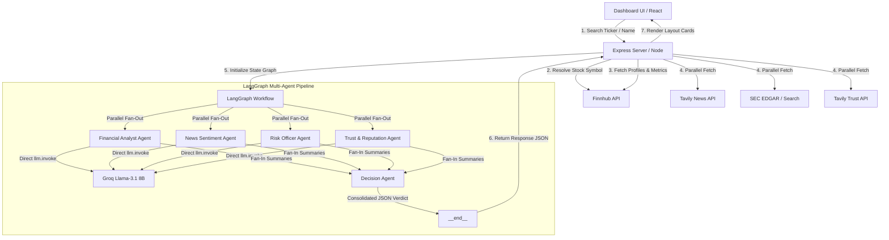

# Clari: Multi-Agent Investment Research Terminal

Clari is an AI-powered financial research terminal designed to run parallel, specialist multi-agent workflows. It ingests data from multiple financial and public feedback channels, resolves ticker symbols, and outputs a structured investment verdict alongside granular agent reports on a custom, responsive Neobrutalist dashboard.

---

##  System Architecture

Clari uses a **Frontend-Backend separation** combined with a **parallel multi-agent workflow** structured using LangGraph.



---

##  Specialist Agent Workflow

All LLM queries inside the LangGraph pipeline are routed through a custom **rate-limit retry helper (`callModel`)** which uses **Groq's `llama-3.1-8b-instant`** model:

1. ** Financial Analyst Agent**: Evaluates company metrics (P/E, profit margins, EPS) and translates complex financial calculations into 2–3 jargon-free bullet points under 12 words.
2. ** News Sentiment Agent**: Evaluates the latest 5 news article contents and returns the prevailing public/market sentiment.
3. ** Risk Officer Agent**: Evaluates SEC filings and reports 2-3 key risks/problems (avoiding legalese in favor of everyday English, e.g. "changing government rules" instead of "regulatory compliance constraints").
4. ** Trust & Reputation Agent**: Gathers public reputation reviews, Glassdoor employee ratings, and brand trust trends to summarize consumer satisfaction.
5. ** Decision Agent**: Synthesizes the four agent reports and issues a consolidated verdict (`Invest`, `Hold`, or `Pass`), a numeric score (`0-100`), key highlights (positive, negative, or warnings), and general reasoning.

---

## Technical Choices & Trade-offs

During the design and implementation, several key architectural trade-offs were made to optimize speed, rate limits, and user experience:

### 1. Model Selection: Groq `llama-3.1-8b-instant` vs. `llama-3.3-70b-versatile`
*   **The Dilemma**: 70B models have higher reasoning capability, but Groq enforces a strict free-tier limit of **100,000 tokens per day (TPD)**. Parallel multi-agent runs (which consume ~10,000 tokens per search) exhaust the 70B limit after only 8–10 searches.
*   **The Choice**: Selected the **8B model**. It offers a **500,000 tokens per day (TPD)** limit (5x higher) and runs with near-zero latency, while remaining highly capable of extracting simple, jargon-free bullet points.

### 2. Parallel Node Execution vs. API Rate Limits (429)
*   **The Dilemma**: Executing four agents in parallel cuts API latency in half, but sending four parallel requests to Groq at the exact same millisecond frequently triggers **429 Too Many Requests (concurrency limits)**.
*   **The Choice**: Retained parallel execution to optimize dashboard speed, but introduced a custom, lightweight **12-line retry helper (`callModel`)** in `agent.js`. It catches 429 errors from standard or custom LangChain classes, waits 2 seconds, and retries the request (up to 3 times), ensuring stable executions.

### 3. Dynamic Dashboard Layouts (Indian & Private Stock Profiles)
*   **The Dilemma**: Indian (NSE/BSE) stocks and private companies do not return standard US financial ratios from Finnhub, resulting in empty, broken `N/A` cards on the dashboard.
*   **The Choice**: Programmed a conditional frontend layout. If financial metrics are missing, the UI dynamically replaces the **Raw Financial Profile** card with a **Sentiment & Data Status** card, displaying a color-coded News Sentiment Index gauge and a checklist of active API connections (Finnhub, EDGAR, Tavily).

### 4. Code Simplicity for Project Defense
*   **The Dilemma**: Complex rate-limiting frameworks (like exponential backoff, custom sleep multipliers, or active Gemini/Groq model fallbacks) make the code harder to explain and defend in front of an interviewer.
*   **The Choice**: Cleaned out all unused Google Generative AI imports, fallback variables, and nested conditions. The model setup uses standard LangGraph annotations and direct, clean LLM queries that any developer can understand and verify in seconds.

---

##  Setup & Installation

### Prerequisites
Make sure you have [Node.js](https://nodejs.org/) installed.

### 1. Environment Configuration
Create a `.env` file in the `Backend/` directory and configure the following keys:
```env
PORT=3000
GROQ_API_KEY=your_groq_api_key
TAVILY_API_KEY=your_tavily_api_key
FINNHUB_API_KEY=your_finnhub_api_key
SEC_USER_AGENT=your_email_or_user_agent
```

### 2. Launch the Backend Server
```bash
cd Backend
npm install
node server.js
```
*The backend server will run on `http://localhost:3000`.*

### 3. Launch the Frontend Terminal
```bash
cd Frontend
npm install
npm run dev
```
*The dashboard will run locally on `http://localhost:5173`.*

---

##  Visual Design System (Neobrutalism)
The terminal UI uses a premium **Neobrutalist design system**:
*   High-contrast borders (`3px solid #000000`)
*   Rigid retro shadows (`box-shadow: 6px 6px 0px #000000`)
*   Vibrant, pastel color-coding for specialist agents (Blue for Finance, Green for Sentiment, Pink for Risk, Purple for Reputation).
*   Clean typography utilizing sans-serif hierarchy for maximum readability.
